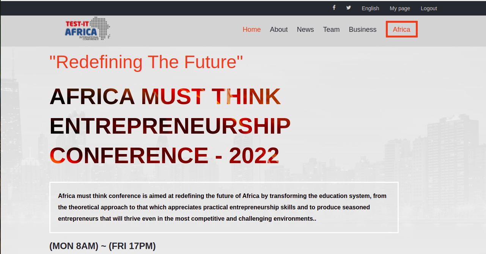
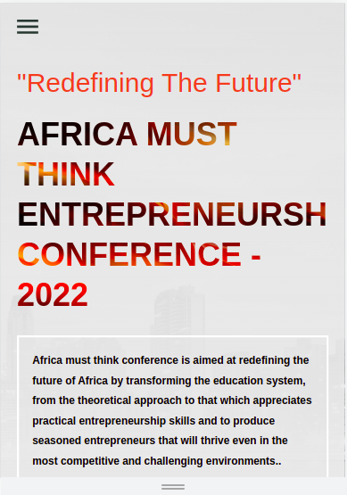

# AMT-CONFERENCE

Africa must think conference is aimed at redefining the future of Africa by transforming the education system from the theoretical approach to that which appreciates practical Entrepreneurship skills. 

Desktop Version.

Mobile Version

## Built With

- HTML
- CSS
- JAVASCRIPT
- VSCODE

## LIVE DEMO

[Live Demo Link](https://evans22j.github.io/AMT-CONFERENCE/)

## DEMO VIDEO LINK

[WATCH DEMO](https://www.loom.com/share/08ebad94e4774b8491249d70951e9488)

## Getting Started

To get a local copy up and running follow these simple example steps.

1. Clone the Repo or Download the Zip file and Extract by clicking here [GitHub Repo]{https://github.com/evans22j/AMT-CONFERENCE.git}
2. mkdir the folder of your choice
3. cd the folder 
4. git clone https://github.com/evans22j/AMT-CONFERENCE.git

## Author

👤 **Evans Sitibekiso**

- GitHub: [@evans22j](https://github.com/evans22j)
- Twitter: [@Evans_22J](https://twitter.com/Evans_22J)
- LinkedIn: [Evans Sitibekiso](https://www.linkedin.com/in/evans-sitibekiso-a85753202/)

## 🤝 Contributing

Contributions, issues, and feature requests are welcome!

Feel free to check the [issues page](../../issues/).

## Show your support

Give a ⭐️ if you like this project!

## Acknowledgments
- Inspired by Original Design idea from
[Cindy Shin In Behance](https://www.behance.net/adagio07)